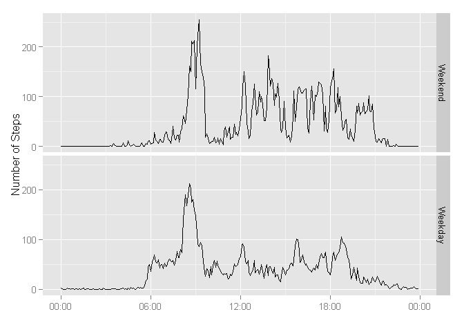

# Reproducible Research: Peer Assessment 1


## Loading and preprocessing the data


```r
library("lubridate")
```

```
## Warning: package 'lubridate' was built under R version 3.1.3
```

```r
knitr::opts_chunk$set(warning=FALSE, message=FALSE, fig.path='figures/')

setwd("G:\\DataScience\\5-ReproResearch\\Assignment1\\RepData_PeerAssessment1")

# Function to create  POSIX timestamps from the "interval" of dataframe
addTS <- function (x) {

  tmp <- ((x$interval %/% 100 * 60) + (x$interval %% 100))*60
  as.POSIXct(tmp, origin = "1970-01-01 8:0:0")
  
}

# Read raw data
rawdata <- read.csv("activity.csv")
rawdata$DT <- ymd(rawdata$date) + (rawdata$interval %/% 100 * 60 + rawdata$interval %% 100) * 60
```

## What is mean total number of steps taken per day?


```r
stepsPerDay <- aggregate(steps ~ date, rawdata, sum, na.action = na.pass)

meanStepsPerDay <- mean(stepsPerDay$steps, na.rm=TRUE)
medianStepsPerDay <- median(stepsPerDay$steps, na.rm=TRUE)
```

### A histogram of the total number of steps taken each day


```r
library(ggplot2)
library(scales)
qplot(steps, data=stepsPerDay, geom="histogram", binwidth = 2000)
```

 

### Calculate and report the mean and median total number of steps taken per day

The mean number of steps taken per day is 1.0766189\times 10^{4}, the median number of steps is 10765.


## What is the average daily activity pattern?

1. Make a time series plot (i.e. type = "l") of the 5-minute interval (x-axis)
and the average number of steps taken, averaged across all days (y-axis)


```r
stepsPerInterval <- aggregate(steps ~ interval, rawdata, mean, na.rm=FALSE)
stepsPerInterval$TS <- addTS(stepsPerInterval)

ggplot(data = stepsPerInterval, aes(TS, steps)) + geom_line() + 
  scale_x_datetime(labels = date_format("%H:%M") ) + 
  xlab("") + 
  ylab( "Number of Steps")
```

 

2. Which 5-minute interval, on average across all the days in the dataset,
contains the maximum number of steps?


```r
maxStepsInterval <- stepsPerInterval[ which(stepsPerInterval$steps == max(stepsPerInterval$steps)),]
maxStepsTime <- format(maxStepsInterval$TS[1], format="%H:%M")
```

The time interval 08:35 contains the maximum number of steps.


## Imputing missing values

**1. Calculate and report the total number of missing values in the dataset
(i.e. the total number of rows with NAs)**


```r
cntNA <- sum(is.na(rawdata$steps))
```

There are 2304 rows with NAs in the dataset.


**2. Devise a strategy for filling in all of the missing values in the dataset. The
strategy does not need to be sophisticated. For example, you could use
the mean/median for that day, or the mean for that 5-minute interval, etc.**


```r
avgStepsPerInterval <- aggregate(steps ~ interval, rawdata, mean, na.rm=TRUE)
```

**3. Create a new dataset that is equal to the original dataset but with the
missing data filled in.**


```r
# Function to 
myReplacer <- function(x) {
  
  if (is.na(x[1])) {
    # when value is NA, use the value from "average Steps per Day" from that interval
    tmp <- avgStepsPerInterval[ which(avgStepsPerInterval$interval == as.integer(x[3])),]      
    res <- tmp$steps
    
  } else {
    
    res <- x[1]
  }
  as.numeric(res)
}
rawdata$amendedSteps <- apply(rawdata, 1, myReplacer)
```


**4. Make a histogram of the total number of steps taken each day.**


```r
stepsPerDayAmend <- aggregate(amendedSteps ~ date, rawdata, sum, na.rm=TRUE)
qplot(amendedSteps, data=stepsPerDayAmend, geom="histogram", binwidth = 2000)
```

 

```r
amendedMeanStepsPerDay <- mean(stepsPerDayAmend$amendedSteps)
amendedMedianStepsPerDay <- median(stepsPerDayAmend$amendedSteps)
```

**Calculate and report the mean and median total number of steps taken per day. Do
these values differ from the estimates from the first part of the assignment?**


```r
# Create output table to compare mean/median
Category <- c("RawData", "AmendedData")
Mean <- c(meanStepsPerDay, amendedMeanStepsPerDay )
Median <- c(medianStepsPerDay, amendedMedianStepsPerDay)
df <- data.frame(Category, Mean, Median)
df
```

```
##      Category     Mean   Median
## 1     RawData 10766.19 10765.00
## 2 AmendedData 10766.19 10766.19
```
?r
There is no difference for the mean, and a small difference for the median.

**What is the impact of imputing missing data on the estimates of the total
daily number of steps?**


```r
summary(stepsPerDay$steps)
```

```
##    Min. 1st Qu.  Median    Mean 3rd Qu.    Max.    NA's 
##      41    8841   10760   10770   13290   21190       8
```

```r
summary(stepsPerDayAmend$amendedSteps)
```

```
##    Min. 1st Qu.  Median    Mean 3rd Qu.    Max. 
##      41    9819   10770   10770   12810   21190
```
Imputing the number of steps reduces the standard deviation. 


## Are there differences in activity patterns between weekdays and weekends?

**1. Create a new factor variable in the dataset with two levels - "weekday"
and "weekend" indicating whether a given date is a weekday or weekend
day.**


```r
# Function to create the factor variable for "weekday/weekend"
WeekdayFactor <- function (x) {  
  if(as.POSIXlt(x)$wday <=5) {
      res <- "Weekday"
  } else {
      res <- "Weekend"
  }
  res
}

# apply to all elements of the list
rawdata$WD <- factor(sapply(rawdata$DT, WeekdayFactor))
```


**2. Make a panel plot containing a time series plot (i.e. type = "l") of the
5-minute interval (x-axis) and the average number of steps taken, averaged
across all weekday days or weekend days (y-axis). **


```r
library(dplyr)

# get mean steps by day and interval
by_WD <- group_by(rawdata, WD, interval)
avgSteps <- summarise(by_WD, steps= mean(amendedSteps, na.rm=TRUE))
avgSteps$TS <- addTS(avgSteps)

# Reorder factor to show weekend first in chart
avgSteps$WD <- factor(avgSteps$WD,levels(avgSteps$WD)[c(2,1)])

# plot 
ggplot(avgSteps, aes(TS, steps)) + 
  geom_line() + 
  facet_grid(WD ~ .) + 
  scale_x_datetime(labels = date_format("%H:%M") ) + 
  xlab("") + 
  ylab( "Number of Steps")
```

 
